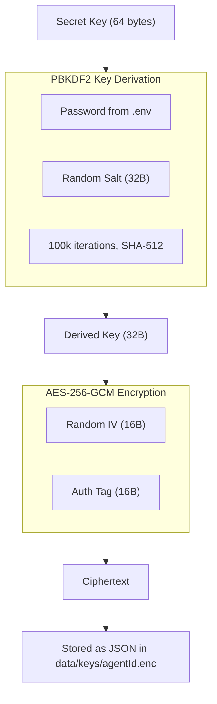
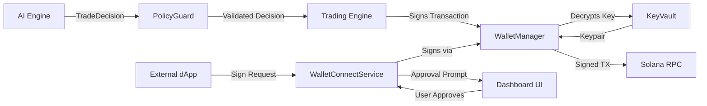
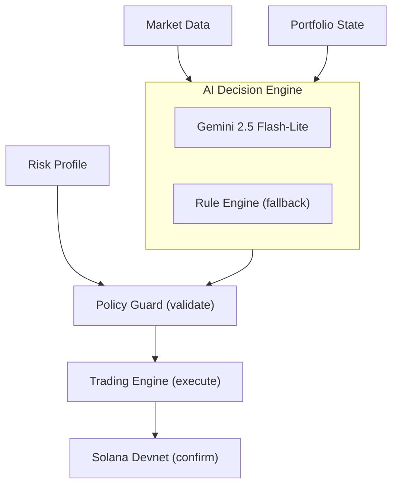
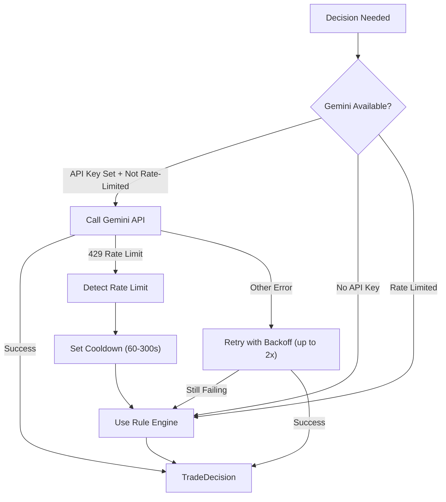
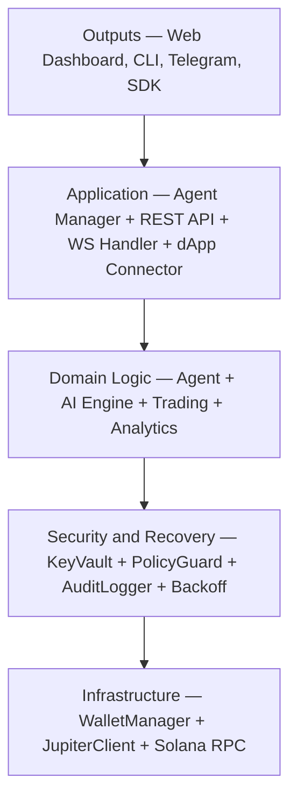
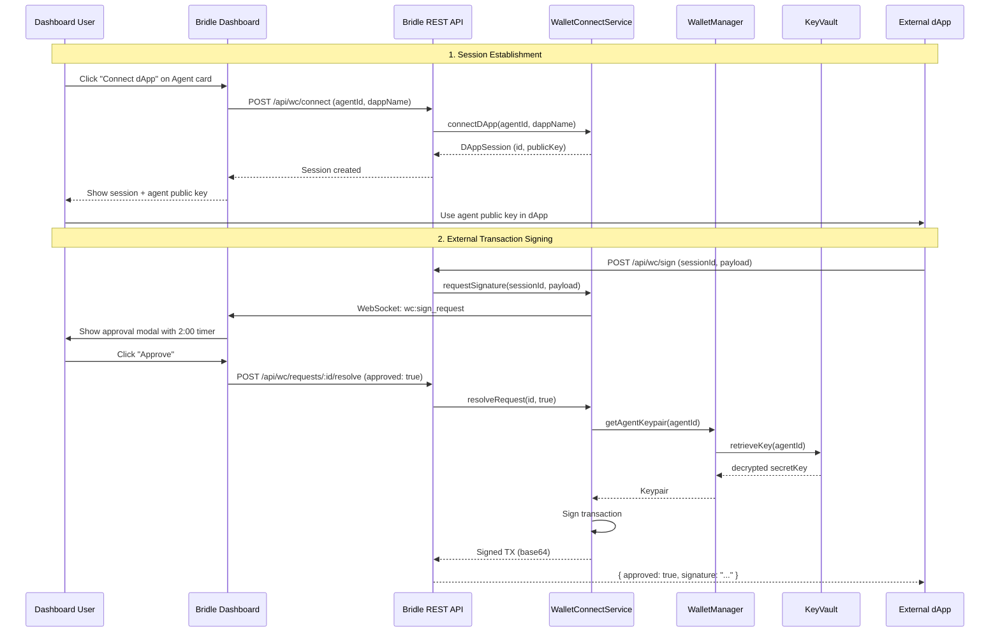
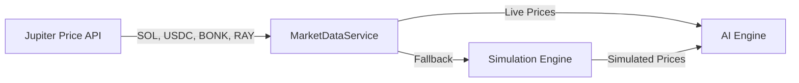
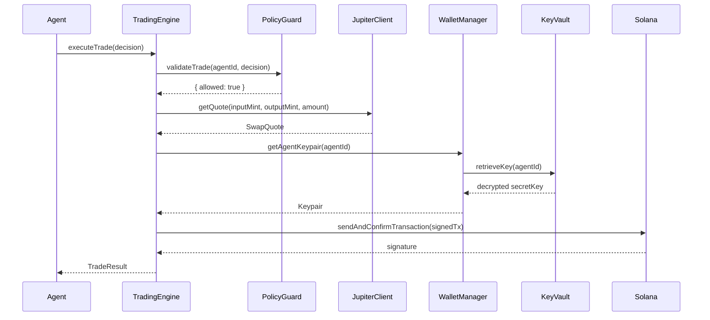

# Deep Dive: Bridle Agentic Wallet Platform

## Overview

Bridle is a prototype multi-agent autonomous wallet platform built on Solana for the [Superteam Nigeria DeFi Developer Challenge](https://superteam.fun/earn/listing/defi-developer-challenge-agentic-wallets-for-ai-agents). It demonstrates how AI agents can independently create wallets, manage funds, make trading decisions, and execute transactions without human intervention.

This document covers the design decisions, security architecture, AI integration, and how the system components interact. It serves as the written deep dive required by the bounty.

---

## 🏆 Hackathon Requirements & Judging Criteria

Bridle was engineered to explicitly fulfill and exceed the Superteam Nigeria "Agentic Wallets for AI Agents" technical expectations:

### Core Requirements
- **Create a wallet programmatically:** Agents autonomously generate encrypted Ed25519 keypairs upon initialization (`WalletManager.ts`).
- **Autonomous Transactions:** Uses encrypted keys held in memory to sign on-chain transactions without any human intervention (`TradingEngine.ts`).
- **Devnet SPL/SOL Holdings:** Agents request airdrops and maintain live balances of SOL and SPL tokens.
- **dApp Interaction:** Integrates live Jupiter Price API feeds to quote and simulate Jupiter-style swaps.
- **dApp Connector:** External Solana dApps can connect to agent wallets via the dashboard; all external signing requires explicit human approval with a 2-minute timeout (`WalletConnectService.ts`).
- **Deep Dive (Written):** This document details the AES-256-GCM encryption, the strict separation of AI logic from private keys, and the systemic security model.

### Technical Expectations & Judging
- **Security & Key Management:** Bank-grade AES-256-GCM + PBKDF2 encryption. Keys never touch the disk in plaintext.
- **Simulation/Decision-making:** Gemini parses live market data feeds to provide reasoned BUY/SELL/HOLD JSON outputs, supported by an automatic `RuleEngine` fallback for API degradation.
- **Separation of Responsibilities:** Clean boundary between the `AIEngine` (generates decisions), `PolicyGuard` (enforces daily limits), and `WalletManager` (signs transactions). The AI never touches the private key.
- **Scalability:** The `AgentManager` proves scalability by orchestrating varying numbers of concurrent agents with isolated wallets, balances, and AI decision loops.

---

## 1. Wallet Design

### The Problem

For AI agents to act as autonomous participants in the Solana ecosystem, they need wallets they fully control. Unlike human-managed wallets, agentic wallets must:

- Be created programmatically without manual key generation
- Sign transactions automatically based on AI decisions
- Hold funds securely even though no human oversees day-to-day operations
- Operate within safety boundaries to prevent catastrophic losses

### Why One Keypair Per Agent?

Each agent gets its own Solana keypair. This is a deliberate design choice:

- **Isolation** — A compromised agent cannot access another agent's funds. The blast radius of any security incident is limited to a single wallet.
- **Auditability** — Each wallet has its own on-chain transaction history. You can verify every trade an agent made by querying the Solana explorer with its public key.
- **Scalability** — Agents are fully independent with no shared state contention. Spawning a new agent is a single API call.
- **Policy enforcement** — Per-agent spending limits, daily caps, and cooldowns are enforced at the wallet level.

### Key Generation

We use `@solana/web3.js`'s `Keypair.generate()` which creates Ed25519 keypairs using a cryptographically secure random number generator (CSPRNG). The keypair exists in memory only long enough to be encrypted — the plaintext secret key is never written to disk, logged, or transmitted over the network.

### Encrypted Key Storage

The encryption pipeline for each agent's secret key:



**Key design choices:**

- **PBKDF2 with 100,000 iterations** of SHA-512 makes brute-force attacks computationally expensive. At 10,000 guesses/second, testing just 1 billion passwords would take ~27 hours.
- **Unique salt per key** prevents rainbow table attacks. Even if two agents have the same secret key, the encrypted output is completely different.
- **AES-256-GCM** provides both confidentiality (encryption) and authenticity (tamper detection). If someone modifies the ciphertext, decryption will fail rather than producing a corrupted key.
- **Unique IV per encryption** ensures that re-encrypting the same key produces different ciphertext, preventing pattern analysis.
- **Secure deletion** overwrites key files with random data before unlinking from the filesystem, preventing recovery from disk.

### Encrypted Key File Format

Each agent's key is stored as a JSON file in `data/keys/{agentId}.enc`:

```json
{
  "iv": "hex-encoded 16-byte initialization vector",
  "salt": "hex-encoded 32-byte random salt",
  "authTag": "hex-encoded 16-byte GCM authentication tag",
  "encrypted": "hex-encoded ciphertext of the 64-byte secret key"
}
```

---

## 2. Security Considerations

### Threat Model

| Threat | Mitigation | Risk Level |
|--------|------------|------------|
| Key theft from disk | AES-256-GCM encryption with PBKDF2-derived keys | Low |
| Key exposure in memory | Keys decrypted only during signing, immediately discarded | Medium |
| Runaway agent spending | PolicyGuard enforces per-trade and daily limits | Low |
| Unauthorized tokens | Token whitelist prevents interactions with unknown contracts | Low |
| Trade flooding | Configurable cooldown periods between trades | Low |
| Audit tampering | Append-only JSONL log files (no edit/delete operations) | Medium |
| API abuse | Agent management requires direct server access | Medium |
| Encryption password leak | Stored in `.env`, excluded from Git via `.gitignore` | Low |

### Defense in Depth

Security is enforced at multiple layers:

1. **Infrastructure Layer** — Keys encrypted at rest, secrets in `.env`, files gitignored
2. **Policy Layer** — Trade size limits, daily spending caps, cooldown enforcement
3. **Application Layer** — Audit logging, error isolation, graceful degradation
4. **Network Layer** — All Solana communication via HTTPS RPC
5. **Operational Layer** — Secure key deletion on agent removal

### What Would Change for Production

1. **HSM/TEE Integration** — Use hardware security modules or Trusted Execution Environments for key operations. The signing would happen inside secure enclaves (e.g., AWS Nitro, Intel SGX).
2. **Multi-sig Approval** — High-value trades could require multi-signature approval, combining the agent's key with a human-controlled key.
3. **Rate Limiting** — Add API rate limiting and authentication to prevent unauthorized agent spawning.
4. **Key Rotation** — Periodic key rotation with re-encryption to limit exposure windows.
5. **Encrypted Audit Logs** — Sign log entries with a separate key to provide cryptographic tamper evidence.
6. **Access Control** — Role-based access for API endpoints with JWT authentication.
7. **Mainnet Guards** — Additional confirmation steps, value thresholds, and human-in-the-loop approval for real-value transactions.

---

## 3. AI Agent Integration

### How AI Agents Interact with Wallets

The AI agent does not directly access keys. The architecture enforces a clean separation:



The AI engine never sees the secret key. It produces a `TradeDecision` (action, amount, tokens, reasoning), which flows through policy validation before the trading engine requests a signature from the wallet manager. External dApps follow a separate path through the `WalletConnectService`, which routes signing requests to the dashboard for explicit human approval before using the same `WalletManager` to sign. This is analogous to a trader telling a custodian what to do — the trader never handles the vault keys, and outside parties need explicit permission.

### Decision Engine Architecture



### How LLM Decisions Work

The AI engine sends a structured prompt to Google Gemini containing:

- **Market data**: Current prices, 24h changes, volumes, and overall trend (bullish/bearish/sideways)
- **Portfolio state**: SOL balance, token holdings, and total estimated USD value
- **Risk profile**: Max trade size, daily limit, stop-loss/take-profit percentages, and preferred tokens
- **Clear instructions**: Respond with structured JSON containing the decision

The LLM returns a decision with:
- **Action**: `BUY`, `SELL`, or `HOLD`
- **Token pair**: Which tokens to swap (e.g., SOL → USDC)
- **Amount**: How much to trade (in SOL), respecting the risk profile
- **Confidence**: 0.0 to 1.0 confidence score
- **Reasoning**: Natural language explanation of why this decision was made

### Automatic Fallback System

The platform handles LLM unavailability gracefully:



When Gemini hits rate limits, the system:
1. Detects the 429 error and extracts the retry delay
2. Marks the AI engine as rate-limited for the specified cooldown period
3. Seamlessly falls back to the Rule Engine for immediate decisions
4. Automatically retries Gemini when the cooldown expires

The Rule Engine uses:
- **Short/Long moving average crossover** for trend detection (5-period vs 20-period)
- **Momentum indicators** for signal strength
- **Risk-adjusted position sizing** based on the agent's profile
- **All decisions are prefixed with `[RuleEngine fallback]`** so operators can distinguish AI from rule-based decisions

---

## 8. Separation of Concerns



Each layer has a clear, single responsibility:

| Layer | Module | Responsibility |
|-------|--------|---------------|
| **Outputs** | Dashboard, Telegram, CLI | Display real-time agent activity and push alerts |
| **Application** | AgentManager, API, WSHandler, WalletConnectService | Orchestrate agent lifecycle, external dApp connections, and communication |
| **Domain** | Agent, AIEngine, TradingEngine, Analytics | Business logic: decisions, execution, and P&L tracking |
| **Security** | KeyVault, PolicyGuard, AuditLogger | Encryption, validation, compliance, and error recovery |
| **Infrastructure** | WalletManager, JupiterClient | Blockchain interaction and swap routing |

This separation ensures that:
- The AI module knows nothing about encryption or transaction signing
- The wallet module knows nothing about trading strategy
- The policy module can be independently audited
- External dApp connectors route through a separate approval path, isolated from the AI decision loop
- Each module can be tested, replaced, or upgraded independently

---

## 4. dApp Connector Architecture

Bridle extends the agent wallet concept beyond autonomous trading. The **WalletConnectService** allows external Solana dApps (like Jupiter, Raydium, or any Solana protocol) to connect to an agent's wallet and request transaction signatures — all subject to explicit human approval through the dashboard.

### Why This Matters

Traditional agentic wallets are "islands" — they can only interact with protocols their internal trading engine is coded for. Bridle's dApp Connector breaks this limitation: once an external dApp connects to an agent's wallet, the agent's address can participate in **any** Solana protocol — swaps, lending, staking, NFTs — without modifying the core codebase.

### Connection and Signing Flow



### Security Model for dApp Connections

| Concern | Mitigation |
|---------|------------|
| Unauthorized access | Sessions are tied 1-to-1 with specific agents; isolated from other agents |
| Blind signing | All sign requests are forwarded to the dashboard with full context; human must approve |
| Stale requests | Sign requests auto-expire after 2 minutes if not acted upon |
| Key exposure | Keys are never sent to the dApp; signing happens server-side in the KeyVault |
| Session hijacking | Sessions are UUID-based and managed server-side; disconnection invalidates immediately |

## 5. Live Market Data

Bridle fetches real-time prices from the **Jupiter Price API** (free, no API key required).

### Data Flow



### How It Works

1. **Primary**: Fetches live USD prices from `https://api.jup.ag/price/v2` using token mint addresses
2. **Cache**: Results cached for 15 seconds to avoid excessive API calls
3. **Timeout**: 5-second fetch timeout prevents the agent from hanging
4. **Fallback**: If Jupiter is unreachable, seamlessly falls back to realistic price simulation
5. **Indicator**: The CLI shows `LIVE` or `SIMULATED` so operators always know the data source

### Supported Tokens

| Token | Mint Address | Source |
|-------|-------------|--------|
| SOL | `So111...1112` | Jupiter Price API |
| USDC | `EPjF...Dt1v` | Jupiter Price API |
| BONK | `DezX...B263` | Jupiter Price API |
| RAY | `4k3D...X6R` | Jupiter Price API |

---

## 6. CLI Demo Tool

Bridle includes a terminal-based demo (`npm run demo`) that showcases the full agent lifecycle without a browser:

```
npm run demo
```

The demo:
1. Initializes all services (wallet, AI, trading, policy)
2. Creates an agent with its own Solana wallet
3. Runs 3 decision cycles against live Jupiter market data
4. Displays colored BUY/SELL/HOLD decisions with confidence scores and reasoning
5. Shows a summary and cleans up

This is useful for judges who want to test from terminal, CI/CD pipelines, or quick validation.

---

## 7. Trading on Solana Devnet

### How Trades Are Executed

On devnet, Jupiter Aggregator API is primarily mainnet-focused, so Bridle uses a simulation approach:

1. **Quote**: The JupiterClient generates a simulated swap quote with realistic pricing, slippage, and routing
2. **Validation**: The PolicyGuard checks the trade against the agent's limits
3. **Execution**: A real on-chain transaction (self-transfer) is signed and submitted as proof of execution
4. **Confirmation**: The transaction is confirmed on Solana devnet and the signature is logged

This approach provides:
- **Real on-chain transactions** — Every trade produces a verifiable signature on Solana Explorer
- **Realistic behavior** — Simulated quotes include slippage and price impact
- **Easy upgrade path** — Switching to real Jupiter swaps requires only changing `useSimulation: false`

### Transaction Signing Flow



---

## 9. Scalability

### Multi-Agent Architecture

The `AgentManager` treats each agent as an independent unit:
- Each agent has its own wallet, decision engine, and trading loop
- Agents share the RPC connection but have fully isolated state
- The event system (pub/sub) decouples agents from the dashboard
- Adding a new agent is a single API call with zero downtime

### Scaling Strategies

| Dimension | Current | Production Path |
|-----------|---------|-----------------|
| Agents per instance | ~10 | Horizontal scaling with message queues |
| Decision latency | ~1-3s (Gemini 2.5-flash-lite) | Batch prompts, model caching |
| RPC calls | Shared connection | Connection pool, dedicated RPC nodes |
| Key storage | File-based | Database or HSM-backed vault |
| Audit logs | Local JSONL files | Centralized logging (ELK, Datadog) |
| Dashboard | Single WebSocket | Load-balanced WebSocket with Redis pub/sub |

---

## 10. Devnet vs Mainnet

This prototype runs exclusively on Solana Devnet. Key differences for a production mainnet deployment:

| Aspect | Devnet (Current) | Mainnet (Future) |
|--------|-------------------|-------------------|
| SOL | Free via faucet airdrop | Real monetary value |
| Trades | Simulated Jupiter quotes | Live Jupiter Aggregator v6 |
| Security | Encrypted file storage | HSM + multi-sig + TEE |
| Policies | Soft limits (learning mode) | Hard limits + human override |
| Monitoring | Dashboard only | Alerting + anomaly detection + PagerDuty |
| Key Management | File-based | Vault (HashiCorp) or AWS KMS |
| Authentication | None (local dev) | JWT + OAuth2 + API keys |

---

## 11. Technologies Used

| Component | Technology | Why |
|-----------|------------|-----|
| Language | TypeScript 5.7 | Type safety critical for financial logic |
| Runtime | Node.js 20+ | Async I/O for concurrent agent loops |
| Blockchain | @solana/web3.js | Direct Solana RPC interaction, transaction signing |
| AI | Google Gemini 2.5-flash-lite | High free-tier limits (1000 req/day), fast inference |
| Market Data | Jupiter Price API | Free real-time prices, no API key needed |
| Encryption | Node.js crypto | AES-256-GCM with PBKDF2 — battle-tested, zero dependencies |
| Server | Express + ws | Lightweight HTTP + WebSocket on same port |
| Dashboard | Vanilla HTML/CSS/JS + Tailwind CSS | Zero build step, zero-dependency base, instant load, Tailwind for responsive design |
| dApp Connector | WalletConnectService (custom) | Lightweight session management for external dApp signing without heavy SDK dependencies |
| CLI | ANSI terminal output | Zero-dependency colored demo for judges |
| Icons | Bootstrap Icons | Clean, consistent iconography via CDN |
| Fonts | Bricolage Grotesque + Outfit | Modern typography for professional UI |

---

## 12. What Makes Bridle Different

Most agentic wallet demos show a single agent executing a hardcoded task. Bridle goes further:

1. **Multi-agent** — N agents running simultaneously, each with independent wallets and strategies
2. **Live market data** — Real Jupiter Price API feeds, not hardcoded or random numbers
3. **Real AI reasoning** — Not just keyword matching; Gemini analyzes market data holistically
4. **Graceful degradation** — Automatic fallback from LLM to rule engine, live data to simulation
5. **Security-first** — Encrypted key storage, policy guards, and audit trails are core features, not afterthoughts
6. **Observable** — Real-time dashboard shows every decision, trade, and balance change as it happens
7. **CLI demo** — Judges can test instantly from terminal with `npm run demo`
8. **Extensible** — Adding new strategies, tokens, or risk profiles requires minimal code changes
9. **dApp Connector** — External Solana dApps can connect to agent wallets for signing, with explicit human-in-the-loop approval via the dashboard

---

Built by [thetruesammyjay](https://github.com/thetruesammyjay) for the Superteam Nigeria DeFi Developer Challenge.
