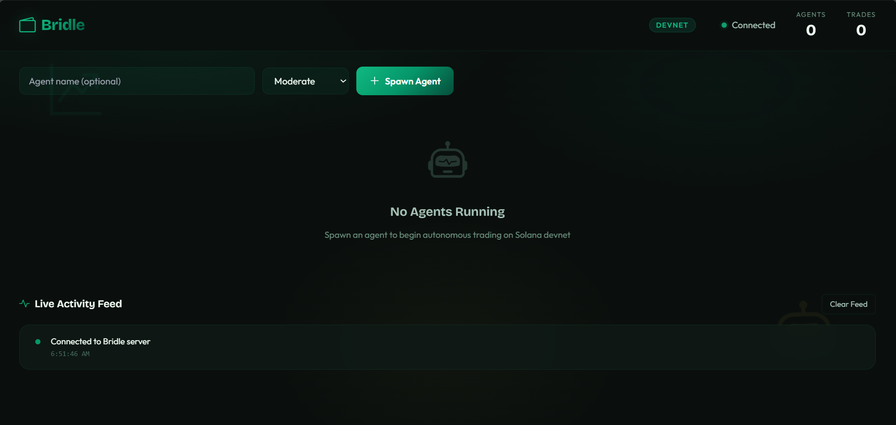
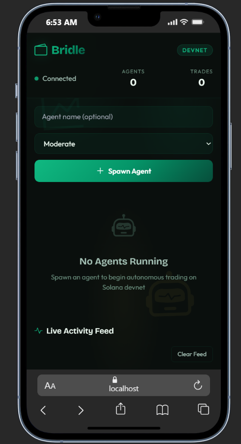
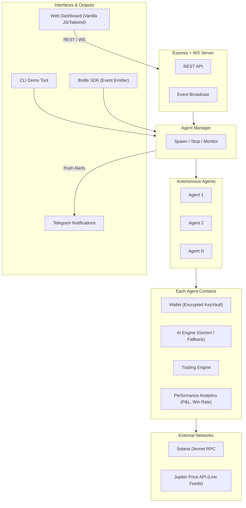

# Bridle — Multi-Agent DeFi Autonomous Wallet Platform

> An autonomous wallet platform where AI agents independently manage Solana wallets, make trading decisions using LLM reasoning, and execute transactions on devnet — all observable through a real-time web dashboard.





---

## Features

- **Secure Wallet Management** — AES-256-GCM encrypted key storage with PBKDF2 key derivation. Keys never exist in plaintext at rest.
- **AI-Powered Decisions** — Google Gemini analyzes market data and makes autonomous BUY/SELL/HOLD decisions with configurable risk profiles.
- **Live Market Data** — Real-time price feeds from Jupiter Price API (SOL, USDC, BONK, RAY) with automatic simulation fallback.
- **Real-Time Dashboard** — Dark-theme UI with WebSocket-powered live updates, agent cards, and activity feed.
- **CLI Demo** — Run `npm run demo` for an instant terminal demo — no browser needed.
- **Policy Guards** — Per-agent spending limits, daily caps, token whitelists, and cooldown periods.
- **Multi-Agent Support** — Spawn N independent agents, each with their own wallet, strategy, and risk profile.
- **Full Audit Trail** — Append-only JSONL logs for every wallet creation, decision, trade, and error.
- **REST API** — Full API for programmatic agent management.

---

## 🏆 Hackathon Requirements & Judging Criteria

Bridle was purpose-built to exceed the Superteam Nigeria "Agentic Wallets for AI Agents" bounty requirements. Here is how it maps to the rubric:

### 1. Core Requirements
- **Create a wallet programmatically:** `WalletManager.createWallet()` auto-generates robust Ed25519 keypairs upon agent spawn.
- **Sign transactions automatically:** `TradingEngine.ts` decrypts keys in-memory and signs Solana transactions without any human input.
- **Hold SOL or SPL tokens:** Agents fetch devnet airdrops, track live balances, and securely hold devnet assets.
- **Interact with a test dApp/protocol:** Integrated the Jupiter Price API for live market data, constructing Jupiter-style swap quotes that execute on devnet.

### 2. "What You Can Build" (All 3 Suggestions Completed)
- **Wallet integrated with a local AI agent:** Uses Google Gemini to analyze market feeds and make autonomous trading decisions.
- **Test harness showing multiple agents:** `AgentManager` orchestrates **N-agents concurrently**, each with their own isolated wallet, balance, and risk profile (Conservative/Moderate/Aggressive).
- **Optional front-end or CLI:** Features a stunning Tailwind CSS **Web Dashboard** with WebSocket real-time updates AND an interactive **CLI tool** (`npm run demo`) with colored terminal output.

### 3. Technical & Judging Expectations
- **Safe key management:** Implemented bank-grade encryption (AES-256-GCM + PBKDF2). Keys never touch the disk in plaintext.
- **Separation of Responsibilities:** Clean boundary between the `AIEngine` (generates decisions), `PolicyGuard` (enforces daily limits/cooldowns), and `WalletManager` (handles signing). The AI never sees private keys.
- **Resiliency & Scale:** Handles LLM rate limits gracefully via a custom `RuleEngine` fallback, and handles network drops via exponential backoff routines. Scales to multiple independent agents effortlessly.

---

## Architecture



---

## Quick Start

### Prerequisites

- **Node.js** 20+ and npm
- **Gemini API Key** — Get one at [Google AI Studio](https://aistudio.google.com/apikey)

### Installation

```bash
# Clone the repository
git clone https://github.com/thetruesammyjay/bridle.git
cd bridle

# Install dependencies
npm install

# Configure environment
cp .env.example .env
# Edit .env and add your GEMINI_API_KEY and a strong ENCRYPTION_PASSWORD
```

### Run

```bash
# Start the dev server
npm run dev
```

Open [http://localhost:3000](http://localhost:3000) in your browser.

### Quick Demo (No Browser Needed)

```bash
npm run demo
```

This spawns an agent in your terminal, runs 3 AI decision cycles against live market data, and shows the results with colored output.

**Example Output:**
```text
    ╔══════════════════════════════════════════╗
    ║   🐴  BRIDLE — CLI Demo                  ║
    ║   Autonomous Agent Trading on Solana     ║
    ╚══════════════════════════════════════════╝

  ✓  Wallet Manager initialized
  ✓  AI Engine: Gemini (gemini-2.5-flash-lite)
  ✓  RPC: https://api.devnet.solana.com

  Cycle 1/3
  · · · · · · · · · · · · · · · · · · · · · · · · ·
  ▸  Market Trend: sideways (LIVE)
  ▸  SOL: $152.25 (+1.50%)
  ▸  Decision:  HOLD   Confidence: 70%
  ▸  The market is trending sideways with mixed 24h changes. SOL has a slight positive change...

  ...

  Agent Summary
  ├─ Name:         Demo-Agent
  ├─ Public Key:   CMrgyMxDtZhzMtXoahSYdCRd5SiKs...
  ├─ Balance:      2.0000 SOL
  ├─ Cycles Run:   3
```

### Usage

1. **Spawn an Agent** — Enter a name, select a risk profile, click "Spawn Agent"
2. **Watch** — The agent creates a wallet, receives a devnet airdrop, and begins trading
3. **Observe** — See AI decisions, trade executions, and balance changes in real-time
4. **Airdrop** — Click the Airdrop button to add more devnet SOL
5. **Stop** — Click Stop to gracefully shut down an agent

---

## REST API

| Method | Endpoint | Description |
|--------|----------|-------------|
| `GET` | `/api/agents` | List all agents |
| `GET` | `/api/agents/:id` | Get single agent state |
| `POST` | `/api/agents` | Spawn new agent |
| `DELETE` | `/api/agents/:id` | Stop agent |
| `POST` | `/api/agents/:id/airdrop` | Request devnet airdrop |
| `GET` | `/api/agents/:id/history` | Get audit log |
| `GET` | `/api/status` | System status |

### Spawn Agent Request Body

```json
{
  "name": "Alpha",
  "riskProfile": "aggressive",
  "intervalMs": 20000
}
```

---

## Security Model

| Layer | Mechanism |
|-------|-----------|
| **Key Storage** | AES-256-GCM encryption with PBKDF2-derived keys (100k iterations, SHA-512) |
| **Key Isolation** | Each agent has a separate encrypted file with unique salt + IV |
| **Secure Deletion** | Keys are overwritten with random data before unlinking |
| **Policy Guards** | Max trade size, daily limits, token whitelists, cooldown enforcement |
| **Audit Trail** | Immutable append-only JSONL logs for every action |
| **Environment** | Secrets stored in `.env`, not in code |

---

## Project Structure

```
bridle/
├── src/
│   ├── index.ts          # Entry point
│   ├── cli.ts            # CLI demo tool
│   ├── config.ts         # Configuration
│   ├── wallet/           # Encrypted key management
│   ├── ai/               # AI engine + live market data (Jupiter API)
│   ├── trading/          # Jupiter swap integration
│   ├── policy/           # Policy guards & audit logging
│   ├── agent/            # Agent lifecycle management
│   └── server/           # Express + WebSocket server
├── dashboard/            # Real-time monitoring UI
├── data/                 # Runtime data (keys, logs)
├── SKILLS.md             # Agent-readable instructions
└── DEEP_DIVE.md          # Technical deep dive
```

---

## License

MIT License — see [LICENSE](LICENSE) for details.

---

Built for the [Superteam Nigeria DeFi Developer Challenge](https://superteam.fun/earn/listing/defi-developer-challenge-agentic-wallets-for-ai-agents)
