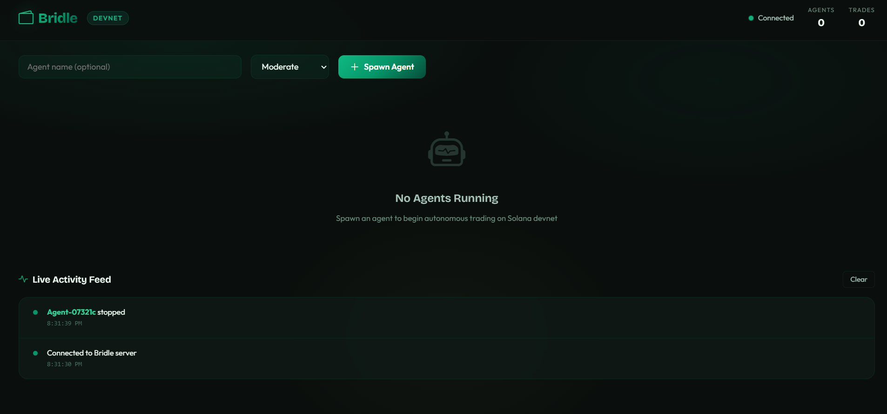
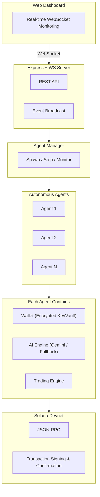

# Bridle — Multi-Agent DeFi Autonomous Wallet Platform

> An autonomous wallet platform where AI agents independently manage Solana wallets, make trading decisions using LLM reasoning, and execute transactions on devnet — all observable through a real-time web dashboard.




---

## Features

- **Secure Wallet Management** — AES-256-GCM encrypted key storage with PBKDF2 key derivation. Keys never exist in plaintext at rest.
- **AI-Powered Decisions** — Google Gemini analyzes market data and makes autonomous BUY/SELL/HOLD decisions with configurable risk profiles.
- **Real-Time Dashboard** — Dark-theme UI with WebSocket-powered live updates, agent cards, and activity feed.
- **Policy Guards** — Per-agent spending limits, daily caps, token whitelists, and cooldown periods.
- **Multi-Agent Support** — Spawn N independent agents, each with their own wallet, strategy, and risk profile.
- **Full Audit Trail** — Append-only JSONL logs for every wallet creation, decision, trade, and error.
- **Trading Engine** — Jupiter-style swap quotes with on-chain transaction signing and confirmation.
- **REST API** — Full API for programmatic agent management.

---

## Architecture



---

## Quick Start

### Prerequisites

- **Node.js** 20+ and npm
- **Gemini API Key** — Get one at [Google AI Studio](https://aistudio.google.com/apikey)

### Installation

```bash
# Clone the repository
git clone https://github.com/thetruesammyjay/bridle.git
cd bridle

# Install dependencies
npm install

# Configure environment
cp .env.example .env
# Edit .env and add your GEMINI_API_KEY and a strong ENCRYPTION_PASSWORD
```

### Run

```bash
# Start the dev server
npm run dev
```

Open [http://localhost:3000](http://localhost:3000) in your browser.

### Usage

1. **Spawn an Agent** — Enter a name, select a risk profile, click "Spawn Agent"
2. **Watch** — The agent creates a wallet, receives a devnet airdrop, and begins trading
3. **Observe** — See AI decisions, trade executions, and balance changes in real-time
4. **Airdrop** — Click the Airdrop button to add more devnet SOL
5. **Stop** — Click Stop to gracefully shut down an agent

---

## REST API

| Method | Endpoint | Description |
|--------|----------|-------------|
| `GET` | `/api/agents` | List all agents |
| `GET` | `/api/agents/:id` | Get single agent state |
| `POST` | `/api/agents` | Spawn new agent |
| `DELETE` | `/api/agents/:id` | Stop agent |
| `POST` | `/api/agents/:id/airdrop` | Request devnet airdrop |
| `GET` | `/api/agents/:id/history` | Get audit log |
| `GET` | `/api/status` | System status |

### Spawn Agent Request Body

```json
{
  "name": "Alpha",
  "riskProfile": "aggressive",
  "intervalMs": 20000
}
```

---

## Security Model

| Layer | Mechanism |
|-------|-----------|
| **Key Storage** | AES-256-GCM encryption with PBKDF2-derived keys (100k iterations, SHA-512) |
| **Key Isolation** | Each agent has a separate encrypted file with unique salt + IV |
| **Secure Deletion** | Keys are overwritten with random data before unlinking |
| **Policy Guards** | Max trade size, daily limits, token whitelists, cooldown enforcement |
| **Audit Trail** | Immutable append-only JSONL logs for every action |
| **Environment** | Secrets stored in `.env`, not in code |

---

## Project Structure

```
bridle/
├── src/
│   ├── index.ts          # Entry point
│   ├── config.ts         # Configuration
│   ├── wallet/           # Encrypted key management
│   ├── ai/               # AI decision engine (Gemini + fallback)
│   ├── trading/          # Jupiter swap integration
│   ├── policy/           # Policy guards & audit logging
│   ├── agent/            # Agent lifecycle management
│   └── server/           # Express + WebSocket server
├── dashboard/            # Real-time monitoring UI
├── data/                 # Runtime data (keys, logs)
├── SKILLS.md             # Agent-readable instructions
└── DEEP_DIVE.md          # Technical deep dive
```

---

## License

MIT License — see [LICENSE](LICENSE) for details.

---

Built for the [Superteam Nigeria DeFi Developer Challenge](https://superteam.fun/earn/listing/defi-developer-challenge-agentic-wallets-for-ai-agents)
