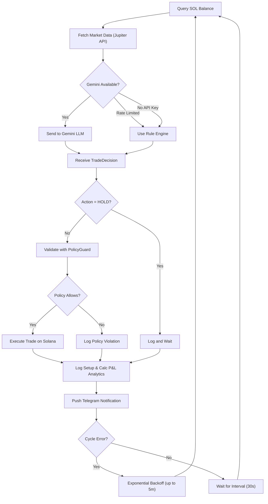

# SKILLS.md — Bridle Agentic Wallet Platform

## What is Bridle?

Bridle is a multi-agent autonomous wallet platform built on Solana. It enables AI agents to operate as independent economic actors — creating their own wallets, analyzing **live market data** from Jupiter Price API, making trading decisions, and executing on-chain transactions without any human intervention.

The platform is designed as a prototype for the [Superteam Nigeria DeFi Developer Challenge](https://superteam.fun/earn/listing/defi-developer-challenge-agentic-wallets-for-ai-agents), demonstrating how agentic wallets can safely participate in the Solana ecosystem.

### 🏆 Hackathon Requirements Fulfillment

Bridle was purpose-built to **exceed** the Superteam Nigeria bounty requirements:
- **Programmatic Wallets:** Agents generate and encrypt their own Ed25519 keypairs upon spawning (`WalletManager.ts`).
- **Autonomous Transactions:** Agents sign on-chain transactions without human input (`TradingEngine.ts`).
- **Test dApp Interaction:** Integrates live Jupiter Price API feeds to construct and simulate Jupiter-style swaps on Devnet.
- **dApp Connector:** External Solana dApps can connect to agent wallets via the dashboard; all external signing requires human approval (`WalletConnectService.ts`).
- **Multiple Agents:** The `AgentManager` orchestrates multiple simultaneous agents, each operating independently with isolated balances and AI decision loops.

### Core Capabilities

1. **Programmatic Wallet Creation** — Each agent generates its own Ed25519 keypair and stores it with AES-256-GCM encryption
2. **Autonomous Fund Management** — Agents hold SOL and SPL tokens on Solana devnet, with balance tracking and airdrop support
3. **AI-Powered Trading Decisions** — Google Gemini (2.5-flash-lite) analyzes market data, portfolio state, and risk profile to decide BUY/SELL/HOLD
4. **Automatic Fallback & Recovery** — Rule-based engine takes over when LLM is unavailable; agents use exponential backoff to recover from transient errors
5. **Transaction Signing** — Agents sign and submit transactions to Solana devnet without human intervention
6. **Policy Enforcement** — Per-agent spending limits, daily caps, token whitelists, and cooldown periods prevent runaway behavior
7. **Performance Analytics** — Live tracking of agent Win Rate, Realized P&L, and decision distributions
8. **Real-time Notifications** — Pushes live trade alerts, errors, and balance updates directly to a configured Telegram Bot
9. **Full Audit Trail** — Every action is logged to append-only JSONL files for accountability
10. **dApp Connector** — Connect external Solana dApps to agent wallets. External transactions require explicit dashboard approval with a 2-minute timeout

---

## How to Use Bridle

### Starting the Platform

```bash
git clone https://github.com/thetruesammyjay/bridle.git
cd bridle
npm install
cp .env.example .env
# Set GEMINI_API_KEY, GEMINI_MODEL, and ENCRYPTION_PASSWORD in .env
npm run dev
```

The server starts on port 3000 by default. Open http://localhost:3000 to access the dashboard.

### CLI Demo (No Browser Needed)

```bash
npm run demo
```

This spawns an agent in your terminal, runs 3 AI decision cycles against **live Jupiter price data**, and displays colored output with market trends, decisions, and reasoning. No browser or server needed.

### Environment Variables

| Variable | Description | Default |
|----------|-------------|---------|
| `GEMINI_API_KEY` | Google Gemini API key | Required |
| `GEMINI_MODEL` | Which Gemini model to use | `gemini-2.5-flash-lite` |
| `ENCRYPTION_PASSWORD` | Password for wallet key encryption | Required |
| `SOLANA_RPC_URL` | Solana RPC endpoint | `https://api.devnet.solana.com` |
| `PORT` | Server port | `3000` |
| `AGENT_INTERVAL_MS` | Decision cycle interval | `30000` (30s) |

### API Endpoints

All endpoints accept and return JSON.

#### Spawn an Agent
```
POST /api/agents
Body: { "name": "MyAgent", "riskProfile": "moderate" }
Response: { "success": true, "agent": { "id": "...", "publicKey": "...", ... } }
```

Risk profiles: `conservative`, `moderate`, `aggressive`

Each profile controls:
- **Conservative**: Max 0.1 SOL/trade, 0.5 SOL/day, prefers USDC, 60s cooldown
- **Moderate**: Max 0.3 SOL/trade, 2 SOL/day, trades SOL and USDC, 30s cooldown
- **Aggressive**: Max 0.5 SOL/trade, 5 SOL/day, trades all tokens, 15s cooldown

#### List Agents
```
GET /api/agents
Response: { "success": true, "agents": [...] }
```

#### Get Single Agent
```
GET /api/agents/:id
Response: { "success": true, "agent": { ... full state ... } }
```

#### Stop an Agent
```
DELETE /api/agents/:id
Response: { "success": true, "message": "Agent stopped" }
```

#### Request Airdrop (Devnet)
```
POST /api/agents/:id/airdrop
Body: { "amount": 1 }
Response: { "success": true, "signature": "...", "newBalance": 1.0 }
```

Note: Devnet faucet has rate limits. If automated airdrop fails, visit https://faucet.solana.com and send SOL to the agent's public key manually.

#### Get Agent Audit History
```
GET /api/agents/:id/history?limit=50
Response: { "success": true, "history": [...audit entries...] }
```

#### System Status
```
GET /api/status
Response: { "success": true, "status": "operational", "agentCount": 2, "uptime": 3600 }
```

#### Connect a dApp to an Agent Wallet
```
POST /api/wc/connect
Body: { "agentId": "<uuid>", "dappName": "Jupiter", "dappUrl": "https://jup.ag" }
Response: { "success": true, "session": { "id": "...", "publicKey": "...", ... } }
```

#### List Active dApp Sessions
```
GET /api/wc/sessions
Response: { "success": true, "sessions": [...] }
```

#### Disconnect a dApp Session
```
DELETE /api/wc/sessions/:id
Response: { "success": true, "message": "Session disconnected" }
```

#### Submit a Sign Request (from dApp)
```
POST /api/wc/sign
Body: { "sessionId": "...", "payload": "<base64 tx>", "description": "Swap 1 SOL for USDC" }
Response: { "success": true, "approved": true, "signature": "<base64 signed tx>" }
```

#### Approve/Reject a Sign Request
```
POST /api/wc/requests/:id/resolve
Body: { "approved": true }
```

#### List Pending Sign Requests
```
GET /api/wc/requests
Response: { "success": true, "requests": [...] }
```

### WebSocket Events

Connect to `ws://localhost:3000` to receive real-time events:

| Event | Description | Data |
|-------|-------------|------|
| `snapshot` | Full state on connect | All agent states |
| `agent:spawned` | New agent created | Name, public key, risk profile |
| `agent:decision` | AI made a decision | Action, confidence, reasoning |
| `agent:trade` | Trade executed on-chain | Signature, amounts, success |
| `agent:balance` | Balance updated | New balance |
| `agent:stopped` | Agent shut down | Agent name |
| `agent:error` | Error occurred | Error message |
| `agent:cycle` | Cycle completed | Cycle count, status |
| `wc:session_created` | dApp connected to agent wallet | Session ID, dApp name, public key |
| `wc:session_disconnected` | dApp session disconnected | Session ID, agent ID |
| `wc:sign_request` | dApp requested transaction signing | Request ID, dApp name, type, payload |
| `wc:sign_resolved` | Sign request approved or rejected | Request ID, status, signature |

### Agent Decision Cycle

Each agent runs an autonomous loop every `AGENT_INTERVAL_MS`:



### Key Management

- Keys are encrypted with AES-256-GCM using a PBKDF2-derived key (100k iterations, SHA-512)
- Each agent has a separate encrypted key file in `data/keys/`
- Decryption requires the `ENCRYPTION_PASSWORD` from environment
- Keys are decrypted only during transaction signing, never cached in memory
- When an agent is deleted, its key file is overwritten with random data before unlinking
- Keys are never exposed via API, logs, or the dashboard

### Extending Bridle

**Adding new trading strategies:**
1. Create a new class implementing the `analyzeAndDecide(agentId, agentName, marketData, portfolio, riskProfile)` method
2. Return a `TradeDecision` object with `action`, `inputToken`, `outputToken`, `amountSOL`, `confidence`, and `reasoning`
3. Register it in the Agent constructor as an alternative to `AIEngine` or `RuleEngine`

**Adding new token support:**
1. Add the token mint address to `JupiterClient.TOKEN_MINTS`
2. Add the token to `MarketDataService.basePrices` with a starting price
3. Update agent policy `allowedTokens` array to include the new token symbol

**Adding new risk profiles:**
1. Edit `src/ai/types.ts` and add a new entry to `DEFAULT_RISK_PROFILES`
2. Define `maxTradeSizeSOL`, `dailyLimitSOL`, `stopLossPercent`, `takeProfitPercent`, `preferredTokens`, and `cooldownMs`
3. The new profile will be available in the API and dashboard

**Switching to mainnet:**
1. Change `SOLANA_RPC_URL` to a mainnet RPC endpoint
2. Update `JupiterClient` to use `useSimulation: false` for live Jupiter quotes
3. Add real mint addresses to `TOKEN_MINTS`
4. Ensure policies are strict enough for real-value transactions
5. Consider adding multi-sig or human-in-the-loop approval for high-value trades

**Connecting external dApps:**
1. Spawn an agent and click **"Connect dApp"** on its card in the dashboard
2. Enter the dApp name (e.g., "Jupiter") and optional URL
3. The session is created and the agent's public key is shared
4. Use the `/api/wc/sign` endpoint to submit signing requests from the dApp
5. The dashboard will prompt for approval; all external transactions require explicit human consent
